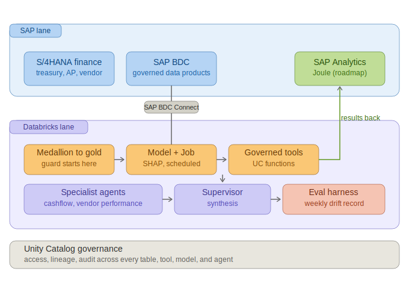

# databricks-journey

> **Published write-up:** [After You Ship the Agent, the Real Work Begins](https://medium.com/@nivasrini620/after-you-ship-the-agent-the-real-work-begins-a3bad4478131) — the full story of the SAP BDC finance multi-agent system (Track 2, use cases 6-9).

Two related bodies of work built on **Databricks**, fed by **SAP Business Data
Cloud (BDC)**. This repo is **separate from `sap-ai-journey/databricks`** (the SAP
AI Core / BDC labs `Lab_A`...`Lab_G`) — no files are shared; the only link is that
the finance-agent work here is the follow-on to `Lab_A_Vendor_Delivery_Risk_SHAP`.

The work splits into two tracks and nine use cases. Each use case has its own doc
under [`docs/`](docs/).

- **Track 1 — Databricks lakehouse learning journey** (use cases 1-5): a hands-on
  intensive on lakehouse fundamentals, the ML lifecycle, Databricks SQL + Genie,
  and two agent builds on a travel dataset.
- **Track 2 — SAP BDC finance multi-agent system** (use cases 6-9): a governed,
  self-monitoring supervisor + specialist agents over SAP finance data, with a
  hand-built drift-monitoring harness.

## Architecture — SAP BDC finance system (Track 2)



*SAP data reaches Databricks via SAP BDC Connect (Delta Sharing, zero-copy at the
boundary); a medallion pipeline materializes gold tables; a data-confidence guard
starts in the gold layer and is carried through UC Function tools, specialist
agents, and the supervisor; an evaluation harness scores the live agents weekly.
Unity Catalog governs every table, tool, model, and agent.*

Alternate views of the same system: [`hero_layered_stack.png`](docs/images/hero_layered_stack.png),
[`hero_zones.png`](docs/images/hero_zones.png), and the agent-layer detail
[`agent_layer_detail.png`](docs/images/agent_layer_detail.png).

## Lakehouse flow (Track 1)

```
samples.bakehouse / samples.wanderbricks
        |
   bronze (raw)  ->  silver (cleaned + data-quality expectations)  ->  gold (serving)
        |                                                                 |
   Delta Sharing                                              MLflow, Genie, dashboards, agents
```

## Use-case index

| # | Use case | Doc | Key files |
|---|----------|-----|-----------|
| 1 | Bakehouse lakehouse foundation (medallion + Delta Sharing) | [docs/01](docs/01-bakehouse-lakehouse-foundation.md) | `databricks-lakehouse/00_setup*`, `01_explore_and_sharing.py`, `medallion_pipeline*`, `my_transformation.sql` |
| 2 | ML lifecycle (MLflow -> registry -> serving -> retrain) | [docs/02](docs/02-ml-lifecycle.md) | `databricks-lakehouse/02_ml_lifecycle.py`, `03_retraining_task.py` |
| 3 | Databricks SQL + Genie | [docs/03](docs/03-databricks-sql-and-genie.md) | `databricks-lakehouse/04_sql_and_genie.py`, `Bakehouse Sales Day 3.lvdash.json` |
| 4 | Travel analytics ETL + tool-calling agent (+ guardrails/MCP) | [docs/04](docs/04-travel-analytics-agent.md) | `databricks-lakehouse/00_wanderbricks_explore.py`, `01_travel_etl.py`, `02_travel_agent.py`, `03_travel_agent_guardrails_mcp.py`, 2 dashboards |
| 5 | Trip-planner RAG agent + NL chat | [docs/05](docs/05-trip-planner-rag-agent.md) | `databricks-lakehouse/04_trip_planner_explore.py`, `05_trip_planner_agent.py`, `06_trip_planner_chat.py` |
| 6 | SAP BDC data discovery | [docs/06](docs/06-sap-bdc-data-discovery.md) | `step_0a/b/c.ipynb`, `cataflog_identify_with_permission.ipynb`, `Procurement_Intelligence/01_explore_and_gold.ipynb` |
| 7 | SAP cash-flow gold + Genie + agent tools | [docs/07](docs/07-sap-cashflow-agent.md) | `lab1_phase1_*`, `quickprofile_goldtable.ipynb`, `Stage C`, `Stage C2` |
| 8 | SAP procurement/vendor multi-agent + eval + SAC export | [docs/08](docs/08-sap-procurement-vendor-agent.md) | `01_procurement_gold.ipynb`, `02_vendor_agent_tools.ipynb`, `03_evaluation_harness.ipynb`, `04_sac_export.ipynb`, `agent_config_records.md` |
| 9 | SAP journal-risk ML + output governance | [docs/09](docs/09-sap-journal-risk-governance.md) | `journal_risk_gold_and_tools.ipynb`, `output_guardrails.ipynb` |

Use cases 6-9 together form one **SAP BDC finance multi-agent system**: a
supervisor routing to cash-flow, vendor, and journal-risk specialists.

## Repo layout

```
databricks-journey/
|-- README.md                     # this file
|-- docs/                         # one doc per use case + images/
|   `-- images/                   # architecture diagrams (png + svg)
|-- databricks-lakehouse/         # Track 1: 14 lakehouse learning scripts
|-- Procurement_Intelligence/     # explore notebook (Track 2)
|-- New Pipeline 2026-05-23 21-03/ # declarative pipeline source (Track 1)
|-- <root .ipynb notebooks>       # Track 2 SAP finance notebooks
|-- *.lvdash.json                 # 3 dashboards
`-- agent_config_records.md       # Agent Bricks agent definitions (records)
```

## Data source

SAP data is read via BDC Delta Share:

```
bdc_share_vendorperformance.`s4_zvendorperformance_dp_srv:v1`.s4custom_vendorperformance
bdc_share_cash_flow.cashflow.cashflow
```

## Notes

- Built on the **SAP Databricks trial / Free Edition**. Managed features (Agent
  Evaluation / Production Monitoring, Genie Space creation, PATs, Model Serving,
  Vector Search, Jobs Create UI) were often gated; where gated, an equivalent was
  hand-built (the evaluation harness and in-notebook RAG are the main examples).
- Six files originally had Windows-illegal characters (`:` `"`) in their names;
  those were sanitized (replaced with `-`) so the repo checks out on Windows.
- A couple of files are superseded/stubs — see the relevant use-case docs
  (`lab1_phase1_layerA` vs `stagea`, and `Procurement_Intelligence/01_explore_and_gold`).
