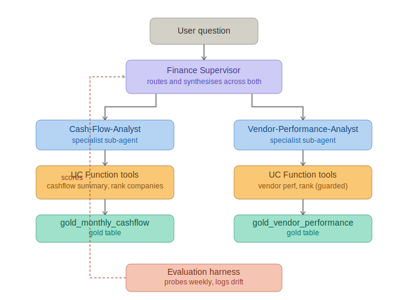

# Use Case 7 — SAP Cash-Flow Gold + Genie + Agent Tools

**Purpose.** Build the monthly cash-flow gold layer from the SAP cash-flow Delta
Share, make it Genie-accurate with metadata, and expose it to the **Cash-Flow-Analyst**
agent through two Unity Catalog Function tools.

*The Cash-Flow-Analyst (left branch) reads `gold_monthly_cashflow` through its UC
Function tools; the supervisor routes to it and synthesizes across it and the
vendor specialist.*

## Files

- `lab1_phase1_stagea_cashflowgoldlayer.ipynb` — **canonical** Stage A: builds
  `workspace.default.gold_monthly_cashflow` (monthly net/inflow/outflow by company
  code) from `bdc_share_cash_flow.cashflow.cashflow`.
- `lab1_phase1_layerA - Cash Flow Gold Layer.ipynb` — **earlier/superseded**
  version that wrote to `workspace.sap_finance_agent` instead of `workspace.default`.
  Kept for history; the `stagea` version is the one used downstream.
- `lab1_phase1_phaseb_metadataforGenieaccuracy.ipynb` — adds table/column comments
  to `gold_monthly_cashflow` (company_code, currency, inflow/outflow semantics,
  period 2015-2025) for Genie NL-to-SQL accuracy.
- `quickprofile_goldtable.ipynb` — profiles the gold table (distinct company codes/
  currencies, date range, per-company totals). Verification only.
- `Stage C — UC Function tool - cash flow summary by company code.ipynb` — creates
  UC function `workspace.default.get_cashflow_summary(p_company_code)`.
- `Stage C2 — UC Function tool #2 - rank company codes by cash flow.ipynb` — creates
  UC function `workspace.default.rank_companies_by_cashflow(p_metric, p_top_n)`.

## Outputs

- Table `workspace.default.gold_monthly_cashflow` (Genie-commented).
- UC functions `get_cashflow_summary`, `rank_companies_by_cashflow` — the
  Cash-Flow-Analyst's tools.
