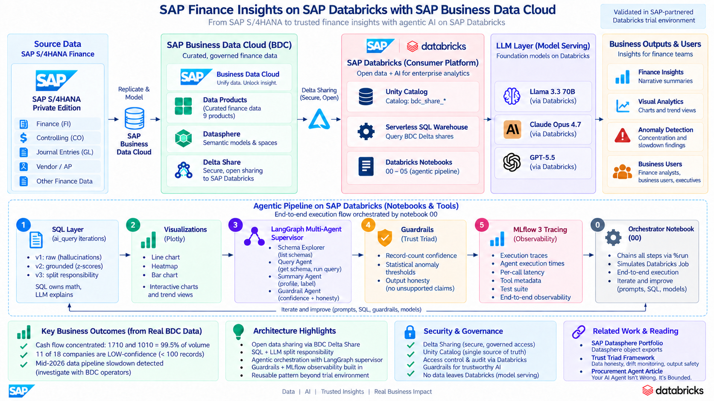
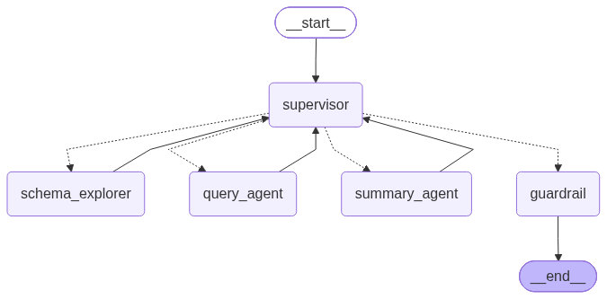

# SAP Finance Insights on Databricks (BDC Trial)

End-to-end agentic pipeline consuming SAP Business Data Cloud (BDC) Delta Shares in Databricks: from raw SQL insights to multi-agent supervisor with guardrails and MLflow tracing.

## Environment

- SAP-partnered Databricks trial (30-day)
- Real S/4HANA data flowing via BDC Delta Shares (9 catalogs, 1.76M rows in cashflow)
- Databricks-hosted LLMs (Llama 3.3 70B, Claude Opus 4.7, GPT-5.5)
- Serverless SQL Warehouse

## Notebooks

Numbered execution order. Notebook 00 is the orchestrator that chains the rest.

| # | File | Purpose |
|---|---|---|
| 00 | `sap_finance_insights_00_orchestrator.ipynb` | Chains all steps via %run (simulates a Databricks Job) |
| 01 | `sql/finance_insights_v1_raw.sql` | ai_query first cut, no grounding (hallucinated fraud claims) |
| 01 | `sql/finance_insights_v2_grounded.sql` | ai_query with statistical baseline (z-scores in LLM prompt) |
| 01 | `sql/finance_insights_v3_split_responsibility.sql` | SQL owns math + labels, LLM owns explanation only (final) |
| 02 | `sap_finance_insights_02_visualizations.ipynb` | plotly line, heatmap, bar on cashflow data |
| 03 | `sap_finance_insights_03_langgraph_agent.ipynb` | Multi-agent supervisor (Schema Explorer + Query Agent + Summary Agent + Guardrail) |
| 04 | `sap_finance_insights_04_guardrails.ipynb` | Data confidence + output honesty rules |
| 05 | `sap_finance_insights_05_mlflow_tracking.ipynb` | mlflow.langchain.autolog instrumentation + test suite |

## Architecture highlights

- **ai_query() iteration story**: v1 hallucinated → v2 grounded → v3 split responsibility. Three concrete lessons.
- **LangGraph supervisor with 4 nodes**: schema_explorer, query_agent, summary_agent, guardrail. Uses Databricks-served LLM via ChatDatabricks.
- **Trust triad** (from prior article): data confidence flag by record count, statistical anomaly threshold, output honesty patterns.
- **MLflow 3 tracing**: full agent execution trees, per-call latency and tool metadata.

## Key business findings from real BDC data

- Cash flow concentrated: company codes 1710 and 1010 = 99.5% of volume
- 11 of 18 companies are LOW-confidence (fewer than 100 records)
- Data pipeline slowdown detected mid-2026 in both major entities (worth investigating with BDC operators)

## Related work

- **[sap-datasphere-portfolio](https://github.com/srini118us/sap-datasphere-portfolio)** — source-side (Datasphere object exports via @sap/datasphere-cli)
- Prior LinkedIn article on Databricks Agents (Agent Bricks) trust triad pattern

## Architecture Diagram

## LangGraph Flow (auto-generated)

Auto-generated via `multi_agent.get_graph().draw_mermaid_png()` — always matches the compiled graph including the guardrail node.

## Related SAP Community Reading

- [Need to Know — Beyond SAP Analytics Cloud AI and Using SAP Databricks in SAP Business Data Cloud](https://community.sap.com/t5/technology-blog-posts-by-sap/need-to-know-beyond-sap-analytics-cloud-ai-and-using-sap-databricks-in-sap/ba-p/14416821) — Peter Pearson, SAP
- [SAP Databricks is the force within SAP BDC to unlock ML/AI capabilities](https://community.databricks.com/t5/technical-blog/sap-databricks-the-force-within-sap-bdc-to-unlock-ml-ai/ba-p/123110) — Krishna_S, Databricks — foundational ai_query on Cash Flow data product
- [SAP Databricks: Building an Intelligent Enterprise with AI Unleashed](https://community.sap.com/t5/technology-blog-posts-by-sap/sap-databricks-building-an-intelligent-enterprise-with-ai-unleashed-part-1/ba-p/14166813) — Multi-part series, SAP

This project extends the ai_query pattern documented above with multi-agent orchestration (LangGraph), data confidence guards, output honesty enforcement, and MLflow tracing for observability.
